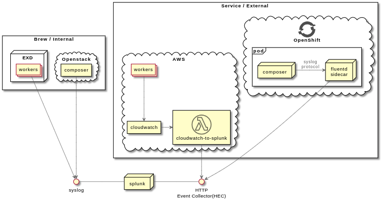

# Logs aggregations

We (Packit) want to have access to logs from our worker pods even after
the pods are restarted (due to image or cluster update).
And ideally, logs from all workers aggregated in one place so that one does
not have to grep several logs. We don’t need it for staging,
but would rather test it on staging first.

## Options

### Testing Farm’s Loki

Initially, we wanted to use [TestingFarm's Loki](http://loki.tft.osci.redhat.com),
but we realized it's in VPN and hence can't be reached by a [Promtail](https://grafana.com/docs/loki/latest/clients/promtail/)
sidecar container running in the Automotive cluster(s) outside the VPN.

### CKI’s Loki in Managed Platform

CKI has a Loki instance as well, but it’s also in VPN.

```text
Michael Hofmann, Jun 3rd, 10:22 AM
We've been thinking of moving it to MP+ where you can have external access to it as well, but this is on our backlog
```

### Managed Loki on Grafana cloud

[Free forever access](https://go2.grafana.com/loki-grafana-cloud.html):
50GB of logs, 14-day retention for logs, access for up to 3 (!) team members

### OpenShift Logging subsystem

A cluster admin can deploy the [logging subsystem](https://docs.openshift.com/container-platform/4.10/logging/cluster-logging.html) to aggregate

- Container logs generated by user applications running in the cluster
- Logs generated by infrastructure components

The [subsystem uses EFK stack](https://docs.openshift.com/container-platform/4.10/logging/cluster-logging.html#cluster-logging-about-components_cluster-logging) (modified ELK stack), i.e.

- [Elasticsearch (ES)](https://www.elastic.co/products/elasticsearch): An object store where all logs are stored. Optimized and tested for short-term storage, approximately seven days.
- [Fluentd](http://www.fluentd.org/architecture): Gathers logs from nodes and feeds them to Elasticsearch
- [Kibana](https://www.elastic.co/guide/en/kibana/current/introduction.html): A web UI for Elasticsearch to view the logs

The [logging subsystem can be installed](https://docs.openshift.com/container-platform/4.10/logging/cluster-logging-deploying.html) by deploying the Red Hat OpenShift Logging and OpenShift Elasticsearch Operators.

- Pros: The operators are (should be) easy to install, set up, and upgrade
- Cons: Elasticsearch (or Loki, see below) are memory-intensive applications.

#### OpenShift Logging subsystem with Loki

Since 4.9 one can [use Loki as an alternative](https://docs.openshift.com/container-platform/4.10/logging/cluster-logging-release-notes.html#cluster-logging-about-loki) to Elasticsearch. However, it’s still a Technology Preview feature as of 4.10.
We initially wanted to use Loki, because that’s what OSCI/CKI uses,
but we are open to any technology, so the default ES is fine.

### [Splunk](https://source.redhat.com/departments/it/splunk)

There’s already a [splunkforwarder](https://console-openshift-console.apps.auto-stage.c58b.p1.openshiftapps.com/k8s/ns/openshift-security/splunkforwarder.managed.openshift.io~v1alpha1~SplunkForwarder/splunkforwarder)
set up on the Automotive clusters, but it’s either not completely configured
or we don’t have access to the data in Splunk because we (jpopelka, ttomecek)
don’t see any auto-[stage|prod] related events in Splunk.

Other teams using Splunk:

- OSCI - they forward logs to Splunk via Jenkins plugin. AStepanov says that
  PSI is configured to automatically forward all pods` logs to Splunk.
  But I couldn’t find anything packit-validation jobs (they run in PSI) related in Splunk.
- Copr (internal) - [uses existing ansible role](https://pagure.io/rhcopr/maint/blob/master/f/maint/share/rhcopr-maint/ansible/playbooks/include/backend/copr-backend.yml#_235)
  to [forward logs to Splunk via syslog](https://docs.engineering.redhat.com/pages/viewpage.action?spaceKey=EXD&title=Instructions+on+Log+forwarding+-+Syslog)
  , AFAIK this can't be used outside VPN
- Image builder
  - Their composer runs in a ROSA cluster as well and uses a [Fluentd sidecar](<(https://github.com/osbuild/osbuild-composer/blob/main/templates/composer.yml#L123)>)
    container which communicates with the main container via syslog and forwards
    the logs to Splunk’s HTTP Event Collector (HEC).
  - 
  - [Fluentd config](https://github.com/osbuild/osbuild-composer/blob/main/templates/composer.yml#L272)

I (jpopelka) decided to follow how the composer does that, i.e.

- have a Fluentd (with [fluent-plugin-splunk-hec](https://github.com/splunk/fluent-plugin-splunk-hec))
  running in a sidecar container, which would forward logs to Splunk's HEC
- let Celery log also [to the Fluentd via syslog](https://docs.fluentd.org/input/syslog)
